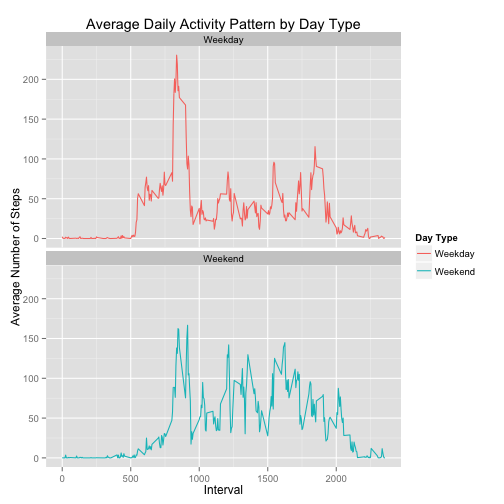

# Reproducible Research Peer Assessment 1 - Personal Activity Data
### David Moorman
### October 2015

## Loading and preprocessing the data

```r
# Note: To ensure portability, this script assumes the input file is 
#       already in the current working directory

# Load required packages
require(dplyr)
```

```
## Loading required package: dplyr
```

```
## Warning: package 'dplyr' was built under R version 3.1.3
```

```
## 
## Attaching package: 'dplyr'
## 
## The following objects are masked from 'package:stats':
## 
##     filter, lag
## 
## The following objects are masked from 'package:base':
## 
##     intersect, setdiff, setequal, union
```

```r
require(ggplot2)
```

```
## Loading required package: ggplot2
```

```r
# Read raw data
df <- read.csv("activity.csv", header = TRUE, na.strings = "NA")

# Combine date and time into datetime variable
d <- as.Date(df$date, format = "%Y-%m-%d")
h <- substr(sprintf("%04d", df$interval), 1, 2)
m <- substr(sprintf("%04d", df$interval), 3, 4)
dt <- paste(d, " ", h, ":", m, sep = "")
df$datetime <- as.POSIXct(dt, tz = "UTC", format = "%Y-%m-%d %H:%M")
```

## What is mean total number of steps taken per day?  
For this part of the assignment, missing values in the dataset will be ignored.

### Calculate the total number of steps taken per day  
Using the dplyr package, the data is grouped by date and the total steps taken
is calculated


```r
# Calculate total steps per day
spd <- df %>%
        group_by(date) %>%
        summarize(totsteps = sum(steps, na.rm = TRUE))

# Summarize steps per day
summary(spd$totsteps)
```

```
##    Min. 1st Qu.  Median    Mean 3rd Qu.    Max. 
##       0    6778   10400    9354   12810   21190
```

### Make a histogram of the total number of steps taken each day  

```r
# Create histogram with ggplot2
ggplot(data = spd, aes(x = totsteps, y = ..density..)) +
        geom_histogram(binwidth = 800, aes(fill = ..count..)) +
        geom_density(aes(x = totsteps, y = ..density..)) +
        scale_fill_gradient("Count", low = "green", high = "red") +
        ggtitle("Histogram (With Density Plot) of Total Steps Per Day") +
        xlab("Steps") +
        ylab("Density")
```

 

Note that the histogram is skewed and appears to have quite a lot of missing 
values (i.e., invervals or entire days with no data). This will be ignored for 
now but addressed later in the analysis.  

Based on this histogram, it appears the individual did not carry the tracker on
ten days (which had zero steps taken). There is also a pronounced spike around
10,000 steps per day, which is a frequently recommended target number of steps 
per day. There are relatively few days with totals just below 10,000 steps, 
compared to days with 10,000 or above. This indicates that the threshold of 
10,000 steps could have been either a target of the tracking program or the
individual participant.

### Calculate and report the mean and median of the total steps taken per day  

```r
summary(spd$totsteps)
```

```
##    Min. 1st Qu.  Median    Mean 3rd Qu.    Max. 
##       0    6778   10400    9354   12810   21190
```

The mean number of steps taken per day was 
9354 and the median was 
10395. Note that these values may differ
from the summary above due to the default precision of the summary() function.

## What is the average daily activity pattern?
Calculate the average daily activity pattern. Concretely, calculate the mean of 
the number of steps taken in a given 5-minute interval across all days.  


```r
# Calculate average steps per interval
spi <- df %>%
        group_by(interval) %>%
        summarize(avgsteps = mean(steps, na.rm = TRUE))
```

### Make a time series plot 
The following plot is a time series plot of the 5-minute interval (x) and the 
average number of steps taken, averaged across all days (y-axis)  


```r
# Create time series plot with ggplot2
ggplot(data = spi, aes(x = interval, y = avgsteps)) +
        geom_line(aes(color = factor("all")), show_guide = FALSE) +
        ggtitle("Time Series Plot of Average Daily Activity Pattern") +
        xlab("Interval") +
        ylab("Average Number of Steps")
```

 

### Identify interval with maximum average steps
In order to identify which 5-minute interval, on average across all the days in 
the dataset, contains the maximum number of steps, the which.max function is 
used to identify the record in the steps per interval (spi) data frame with the 
highest average.


```r
# Identify record with maximum average steps
spi[which.max(spi$avgsteps), ]
```

```
## Source: local data frame [1 x 2]
## 
##   interval avgsteps
## 1      835 206.1698
```

On average, the 5-minute interval of 835 
contains the maximum number of steps--in other words, this is the most active 
period of the day, on average. On average, 
206 steps were taken 
during this 5-minute interval.

## Imputing missing values
As mentioned previously, there are a number of days/intervals where there are 
missing values (coded as NA). The presence of missing days may introduce bias 
into some calculations or summaries of the data.

### Calculate and report the total number of missing values in the dataset
The total number of missing values in the dataset is simply the number of rows 
with NA values for 'steps'.


```r
# Logical vector indicating which records have missing values for 'steps'
na <- is.na(df$steps)
sum(na)
```

```
## [1] 2304
```

There are a total of 2304 missing values in the data.  

### Devise a strategy for filling in all of the missing values in the dataset
The method that will be used to impute missing values is the mean number of 
steps for a given five-minute interval across all days. This value has already 
been calculated for this analysis and will simply be merged with the original 
data where appropriate.  

The underlying assumption in the imputation is that the missing values are not 
missing systematically. In other words, the assumption is that the activity 
during a given interval on a day with missing data is comparable to a 'normal' 
(average) day during the same time interval. More information about the data 
collection methods would be needed to rigorously verify this.

### Create a new dataset without missing data
This new dataset will be created using the dplyr package, by joining the data 
already created summarizing the average number of steps across all days for 
each five-minute interval. The data frame will also contain a logical variable 
'imputed' indicating if the value of 'steps' was imputed or not.


```r
# Identify records where imputation is needed and replace missing values
df.imputed <- df %>%
        bind_cols(data.frame(imputed = na)) %>%
        left_join(spi, by = "interval") %>%
        mutate(steps = ifelse(is.na(steps), avgsteps, steps)) %>%
        select(-avgsteps)
```

As a check, verify that all records have values (i.e., no more missing values):


```r
# Logical vector indicating which records have missing values for 'steps'
na.imputed <- is.na(df.imputed$steps)
sum(na.imputed)
```

```
## [1] 0
```

Now there are 0 missing values in the data.

### Update histogram, mean and median number of steps taken per day


```r
# Calculate total number of steps taken per day (imputed)
spd.imputed <- df.imputed %>%
        group_by(date) %>%
        summarize(totsteps = sum(steps, na.rm = TRUE))

# Create histogram of total number of steps taken per day (imputed)
ggplot(data = spd.imputed, aes(x = totsteps, y = ..density..)) +
        geom_histogram(binwidth = 800, aes(fill = ..count..)) +
        geom_density(aes(x = totsteps, y = ..density..)) +
        scale_fill_gradient("Count", low = "green", high = "red") +
        ggtitle("Histogram (With Density Plot) of Total Steps Per Day (Imputed)") +
        xlab("Steps") +
        ylab("Density")
```

 

```r
summary(spd.imputed$totsteps)
```

```
##    Min. 1st Qu.  Median    Mean 3rd Qu.    Max. 
##      41    9819   10770   10770   12810   21190
```

The updated mean number of steps taken per day was 
10766 and the median was 
10766.  

These values differ from the values calculated earlier. By imputing missing 
values, the median has increased by 
371 steps 
and the mean has increased by 
1412 steps. 
This makes sense, since missing values have been replaced with positive values, 
which would only increase the mean and median. The pattern seen previously with
a pronounced spike in days with 10,000 steps or just above is still present.  

## Are there differences in activity patterns between weekdays and weekends?
In order to distinguish between weekdays and weekends, the weekdays() function
is used. The data used for this portion of the analysis is the imputed data set.
Similar to the processing for the previous section, the factor variable 
'daytype' is added to the imputed data, which is then grouped by day type and 
interval to calculate the average total number of steps taken across all days
for each day type for each five-minute interval.  


```r
# Determine day type and calculate average steps per interval per day type
spi.daytype <- df.imputed %>%
        mutate(daytype = ifelse(weekdays(datetime, TRUE) %in% c("Sat","Sun"),
                                "Weekend", "Weekday")) %>%
        group_by(daytype, interval) %>%
        summarize(avgsteps = mean(steps, na.rm = TRUE))

# Identify maximum activity (and interval) for each day type
maxints <- do.call(rbind, lapply(split(spi.daytype, spi.daytype$daytype), 
                                 function(x) x[which.max(x$avgsteps), ]))

# Create panel plot containing time series plots for each day type
ggplot(data = spi.daytype, aes(x = interval, y = avgsteps, group = daytype)) +
        geom_line(aes(color = daytype)) +
        facet_wrap(~ daytype, nrow = 2) +
        scale_color_discrete(name = "Day Type") + 
        ggtitle("Average Daily Activity Pattern by Day Type") +
        xlab("Interval") +
        ylab("Average Number of Steps")
```

 

It is difficult to tell in this plot, but there is indeed a difference in average
daily activity between weekdays and weekends.  

On weekdays, the maximum average of 
167 steps was 
reached at interval 915.
On weekends, the maximum average of 
230 steps was 
reached at interval 835. In other
words, it appears that daily activity peaked later in the day on weekends.  

By combining the panels and looking at a smoothed function (Loess Curve) instead 
of the time series (which has quite a lot of variation between intervals), the 
broader trend in daily activity compared between weekdays and weekends is a bit 
more clear.  


```r
# Create smoothed (loess local regression) plots of time series
ggplot(data = spi.daytype, aes(x = interval, y = avgsteps, group = daytype)) +
        geom_smooth(method = "loess", aes(color = daytype)) +
        scale_color_discrete(name = "Day Type") + 
        ggtitle("Smoothed Plot of Average Daily Activity Pattern by Day Type") +
        xlab("Interval") +
        ylab("Average Number of Steps")
```

 

In general, it appears that activity began later in the day on weekends, 
but was sustained for a larger portion of the day. On weekdays, activity 
steadily declines beginning around 10:00am. In contrast, on weekends, activity 
continues to increase until around noon (then decreases throughout the 
afternoon).
